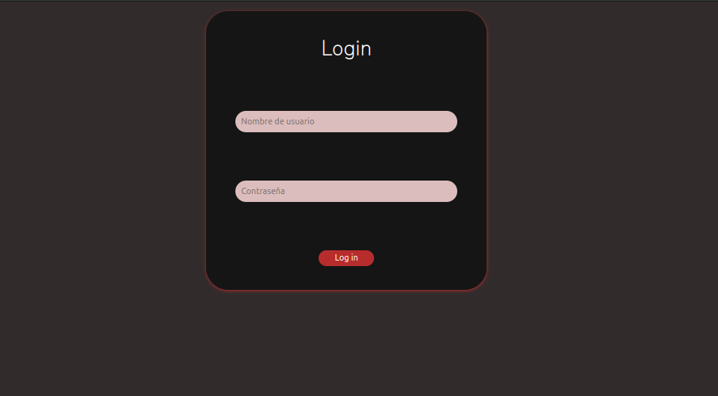
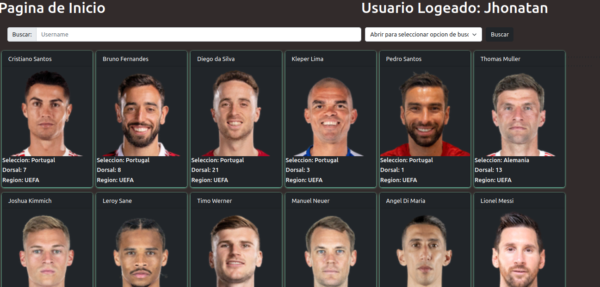
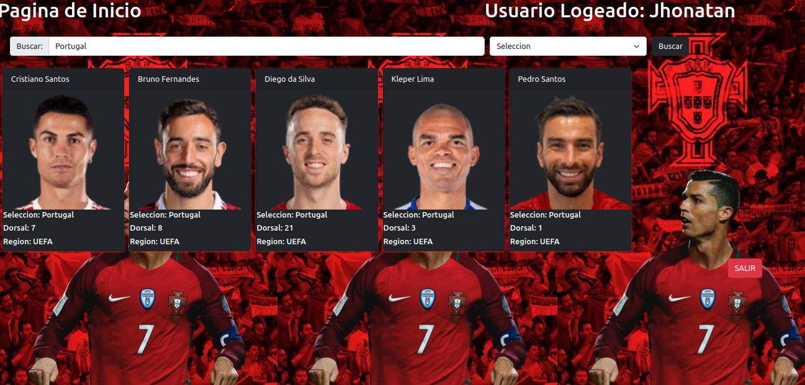

# PROYECTO FINAL IPC1 SEGUNDO SEMESTRE 2022

Este proyecto es una introduccion a la programacion web,En el cual se creo una API REST para lograr la creacion de una pagina web con funcionalidades.

## TABLA DE DATOS

|Carnet     |Nombre     |Nombre Auxiliar    |
|-----------|:---------:|------------------:|
|202106003  |Jhonatan Alexander Aguilar Reyes|Hector Josue Orozco Salazar|

## FRONTEND

Para desarrolar la parte visual de este proyecto se utilizo el framework **Booststrap** y la implementacion de **CSS** para algunos detalles extras. El proyecto fue desarrollado con *HTML* y la implementacion de codigo de **JavaScript** para lograr las funcionalidades de la pagina.

### MANUAL DE USO

Al ingresar al link de la pagina web lo primero que se lograra visualizar es un login en el cual el usuario debe validar sus credenciales y si estas coinciden se le dara acceso a la pagina de inicio



Las credenciales pre-cargados son tres:

1. **Usuario**: Prueba123   y   **Password**: IPC1B 
2. **Usuario**: Prueba456   y   **Password**: IPC1F
3. **Usuario**: Jhonatan    y   **Password**: 202106003

Una vez el usuario haya logrado logearse se direcionara a la pantalla de inicio en la cual pobra visualizar un cuadro en el que podra escribir texto, el nombre del usuario logeado, una lista de opciones, un boton para buscar y un boton para salir. Tambien podra visualizar la lista de todos los stikers pre-cargados.



1. Lo que el usuario debe realizar primero es seleccionar el tipo de busqueda que desea realizar ya sea una busqueda por jugadore, una por seleccion o una por region.
2. El siguiente paso es escrbir el nombre del jugadore, seleccion o region dependiendo de la opcion que haya elegido anteriormente.
3. Despues de esto el usuario debe dar clic en el boton **buscar**, porsteriormente se desplegara una alerta ya sea para indicar que no hay coincidencias para la busqueda o para indicar que la busqueda fue correta.

para el apartado de seleccion la pagina cambiara de diseño dependiendo de la Seleccion que el usuario haya elegido.



El boton de la pagina que tiene como nombre **Salir** redirecciona al usuario a la pagina *login* nuevamente.

## BACKEND

### Modulos

El backend se desarrollo en el lenguaje de programacion python3 en su version *3.10.6* junto a la implementacion de flask y flask cors para el desarrollo de la aplicacion, junto a los formato de texto JSON para guardar la informacion de todos los jugadores

### Requisitos del sistema

Para poder utilizar Flask es necesario al menos la version de *2.6 de Python* o tener instalado *Python3* y se recomienda tener 4 Gb de RAM y Windons 8 en adelante 

### Puerto utilizado

Para esta API se utilizo el puerto 4000

### Descripcion de endpoint

* El endpoint /Usuarios es un metodo de tipo GET el cual retornara una lista de objetos en formato JSON, esto se logro mediante un ciclo for, el cual recorre la lista en la que estan cargados todos los usuarios y para cada uno de estos usuarios los transforma a JSON mediante los metodos get que se definieron en la clase personas, luego de esto cuando ya estan los datos en JSON se guarda cada uno en una lista nueva y esta es la que se retorna para que al momento de llamarlo muestre todos los usuarios que esten cargados.

```Python
    @app.route('/Usuarios', methods = ['GET'])
    def obtenerUsuarios():
        global Administrador
        DatosUsuarios = []
    
        for usuario in Administrador:
            #creando JSON
            objeto = {
                'usuario': usuario.getUsuario(),
                'password': usuario.getPassword()
            }
            DatosUsuarios.append(objeto)
        return(jsonify(DatosUsuarios)) 
```

* El endpoitn /Usuarios/nombre es un metodo tipo GET el cual retornara a un usuario en especifico dependiendo del dato que se le pasa como parametro a la funcion. Se realiza la misma operacion que el endpoint anterior con la diferencia que dentro del for hay un condicional en el cual se validara que el dato pasado como parametro coincida con alguno de los valores que se encuentran cargados y de ser valida, entonces procede a llamar los datos y convertirlos a JSON, los guarda en otra lista y la retorna. En caso de no encontrar coincidencias se crea un objeto en el cual existe un mensaje para indicar que no hubo coincidencias con el parametro.

```Python
  #busca usuarios por nombre
@app.route('/Usuarios/<string:Nombre>', methods=['GET'])
def busquedaUsuario(Nombre):
    global Administrador
    for nombre in Administrador:
        if nombre.getUsuario() == Nombre:
            objeto = {
                'usuario': nombre.getUsuario(),
                'password': nombre.getPassword()
            }
            return(jsonify(objeto))
    salida = {
        "Mensaje": "No se encontro ese usuario"
    }    
    return(jsonify(salida))

```

* El endpoint /Jugadores es un metodo de tipo GET este es similar al primer endpoint descrito en este documento con la diferencia que ahora se estaran utilizando los valores de los jugadores.

```Python
@app.route('/Jugadores', methods=['GET'])
def getJugadores():
    global Jugadores
    DatosJugadores = []
    
    for jugador in Jugadores:
        #Creando JSON de jugadores
        objeto = {
            'Nombre': jugador.getNombre(),
            'Apellido': jugador.getApellido(),
            'Seleccion': jugador.getSeleccion(),
            'Region': jugador.getRegion(),
            'Numero': jugador.getNumero(),
            'Imagen': jugador.getImagen()
        }
        DatosJugadores.append(objeto)
    return(jsonify(DatosJugadores))
```

* El endpoint /Jugadores/nombre es un metodo de tipo GET el cual se encarga de mostrar si hay un jugador que coincida con el valor que se le pasa como parametro. Esta busque se realiza de la misma manera que el segundo endpoint con la diferencia que son los datos de la clase Jugadores.
```Python
  #Busqueda por nombre
@app.route('/Jugadores/<string:Nombre>', methods=['GET'])
def busquedaNombre(Nombre):
    global Jugadores
    for nombre in Jugadores:
        if nombre.getNombre() == Nombre:
            objeto = {
                'Nombre': nombre.getNombre(),
                'Apellido': nombre.getApellido(),
                'Seleccion': nombre.getSeleccion(),
                'Region': nombre.getRegion(),
                'Numero': nombre.getNumero(),
                'Imagen': nombre.getImagen(),
                'Mensaje': "Busqueda exitosa"
            }
            return(jsonify(objeto))
    salida = {
        "Mensaje": "No se encontro ningun jugador"
    }    
    return(jsonify(salida))
``` 

* El endpoint /Jugadores/Selecciones/nombre  es un metodo de tipo GET el cual se encarga de validar cuantos jugadores hay del nombre de la seleccion pasada como parametro para retornarlos. Para esto se hace el mismo algoritmo del endponitn anterior con la diferencia que la lista ahora guardara la informacion de cada uno de los jugadores para que se puedan retornar los jugadores de dicha seleccion

```Python
#Busqueda por Seleccion
@app.route('/Jugadores/Selecciones/<string:Seleccion>', methods=['GET'])
def busquedaSeleccion(Seleccion):
    global Jugadores
    valor = False
    Selecciones = []
    for seleccion in Jugadores:
        if seleccion.getSeleccion() == Seleccion:
            valor = True
            objeto = {
                'Nombre': seleccion.getNombre(),
                'Apellido': seleccion.getApellido(),
                'Seleccion': seleccion.getSeleccion(),
                'Region': seleccion.getRegion(),
                'Numero': seleccion.getNumero(),
                'Imagen': seleccion.getImagen(),
                'Mensaje': "Busqueda exitosa"
            }
            Selecciones.append(objeto)
    if valor == False:
        salida = {
        'Mensaje': "No se encontro dicha Seleccion"
        }    
        return(jsonify(salida))
    else:
        return(jsonify(Selecciones)) 
``` 

* El endpoint /Jugadores/Regiones/nombre es un metodo de tipo GET el cual se encarga de validar cuantos jugadores juega en la region que se le pasa como parametro a la funcion, el algoritmo de busqueda es el mismo que el endpoint anterior con la diferencia que la validacion se hacer con el atributo *Regio* de los jugadores

```Python
#Busqueda por Seleccion
@app.route('/Jugadores/Selecciones/<string:Seleccion>', methods=['GET'])
def busquedaSeleccion(Seleccion):
    global Jugadores
    valor = False
    Selecciones = []
    for seleccion in Jugadores:
        if seleccion.getSeleccion() == Seleccion:
            valor = True
            objeto = {
                'Nombre': seleccion.getNombre(),
                'Apellido': seleccion.getApellido(),
                'Seleccion': seleccion.getSeleccion(),
                'Region': seleccion.getRegion(),
                'Numero': seleccion.getNumero(),
                'Imagen': seleccion.getImagen(),
                'Mensaje': "Busqueda exitosa"
            }
            Selecciones.append(objeto)
    if valor == False:
        salida = {
        'Mensaje': "No se encontro dicha Seleccion"
        }    
        return(jsonify(salida))
    else:
        return(jsonify(Selecciones)) 
```